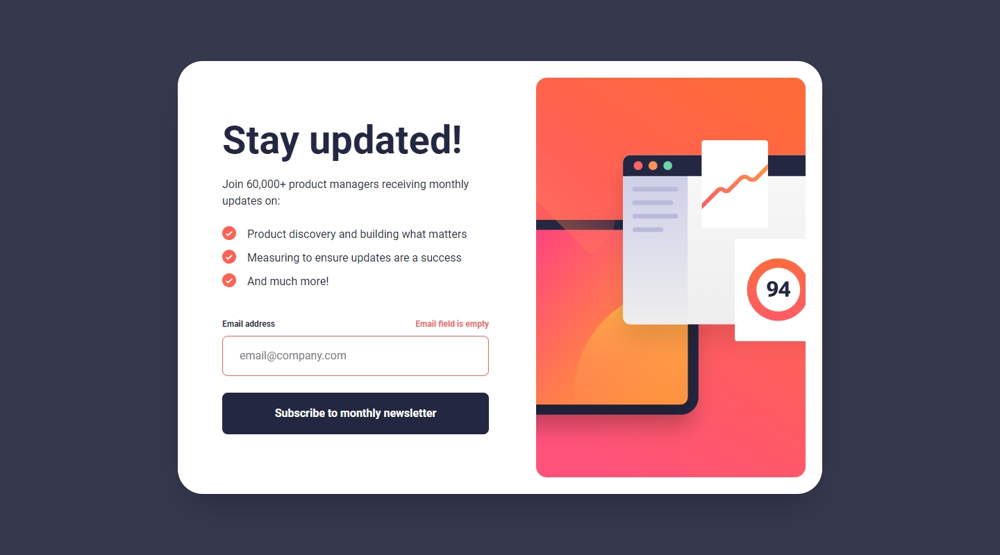
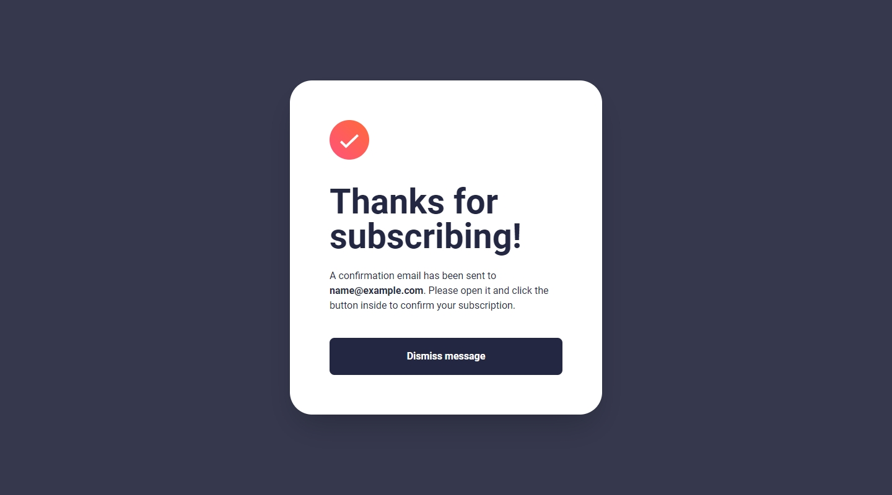
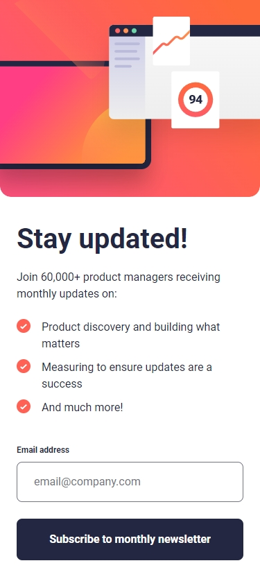

## Frontend Mentor Challenge 14 - Workit Landing Page

This is my solution to the [Newsletter Sign-up Form with Success Message](https://www.frontendmentor.io/challenges/newsletter-signup-form-with-success-message-3FC1AZbNrv) challenge on [Frontend Mentor](https://www.frontendmentor.io/).

#

### Links. 🔗

- Live Site URL: https://newsletter-signup-form-darkstarxdd.vercel.app/

#

### Screenshots of the Solution (Desktop, Confirm State and Mobile). 🔍

#

### Built with. 🔨

- HTML.
- Tailwind.
- TypeScript.
- Zod for input validation.
- Vite.

#

### Features. ✨

- Error messages displayed if the input field is empty or if the email is in an invalid format.
- Input field validated `onInput` after first error. (This allows users to interact with the form without being interrupted by validation errors, until they have attempted to submit invalid data at least once.)
- Confirmation screen if a valid email was submitted.

#

### Testing and Accessibility. 🧪

- Tested site usability with keyboard-only navigation.
- Used the Responsively App to check the site's appearance on various screen sizes, from 320x480 to 3000x2000.
- Set the browser font size on desktop to various values ranging from 9px to 72px to make sure everything on the site scales properly with the user's preferred browser font size.
- Zoomed the page in and out using Ctrl + Scroll wheel (up to 500%).
- Tested with the NVDA screen reader.
- Viewed the site on an iPhone 11 in both portrait and landscape modes.
- Performed Lighthouse and PageSpeed tests. ([PageSpeed Result.](https://pagespeed.web.dev/analysis/https-newsletter-signup-form-darkstarxdd-vercel-app/fw1kqzm91g?form_factor=mobile))

#

### Some Tools I Use. 🔧

- [Responsively.app](https://responsively.app/) - A free and open source tool that allows you to test your webpage on different screen sizes, take screenshots and much more.

- [Favicon.io](https://favicon.io/) - Generates favicons.

- [Google Webfonts Helper by Mario Ranftl](https://gwfh.mranftl.com/fonts) - Provides WOFF2 format for Google Fonts.

#

- My Frontend Mentor Profile - [@DarkstarXDD](https://www.frontendmentor.io/profile/DarkstarXDD)
